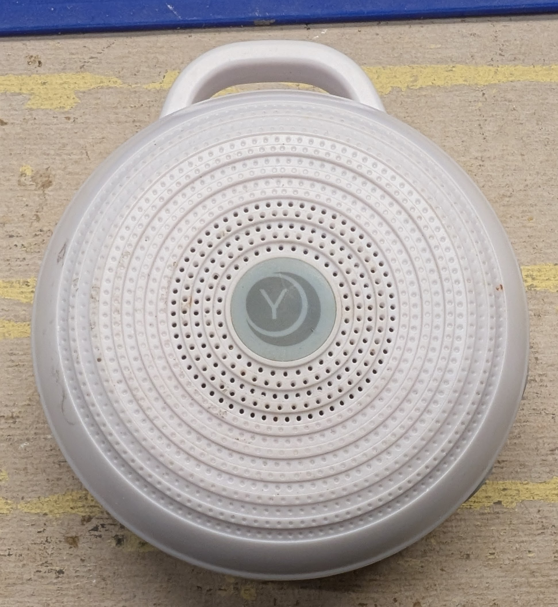
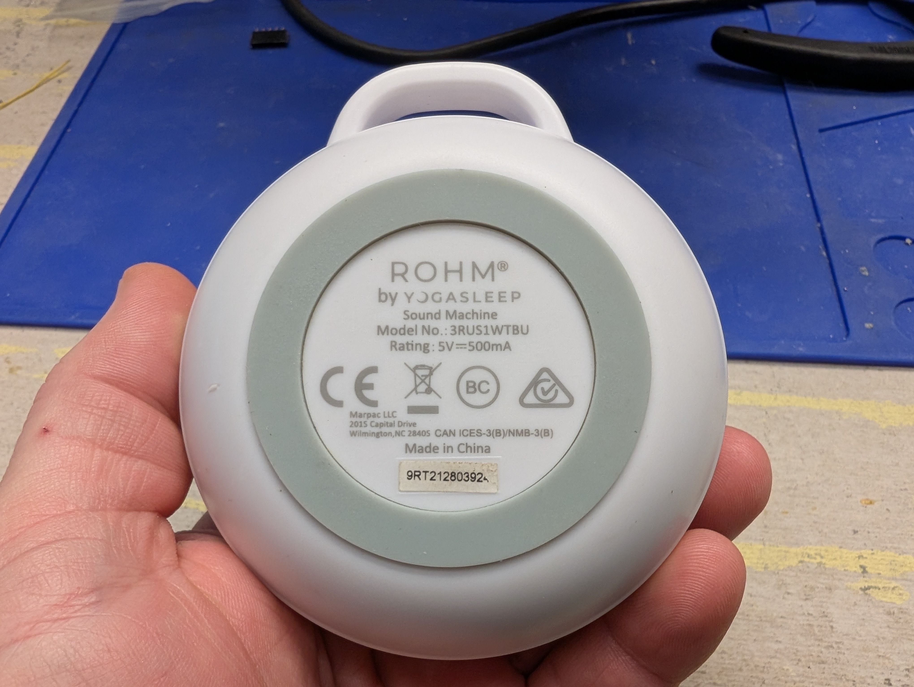
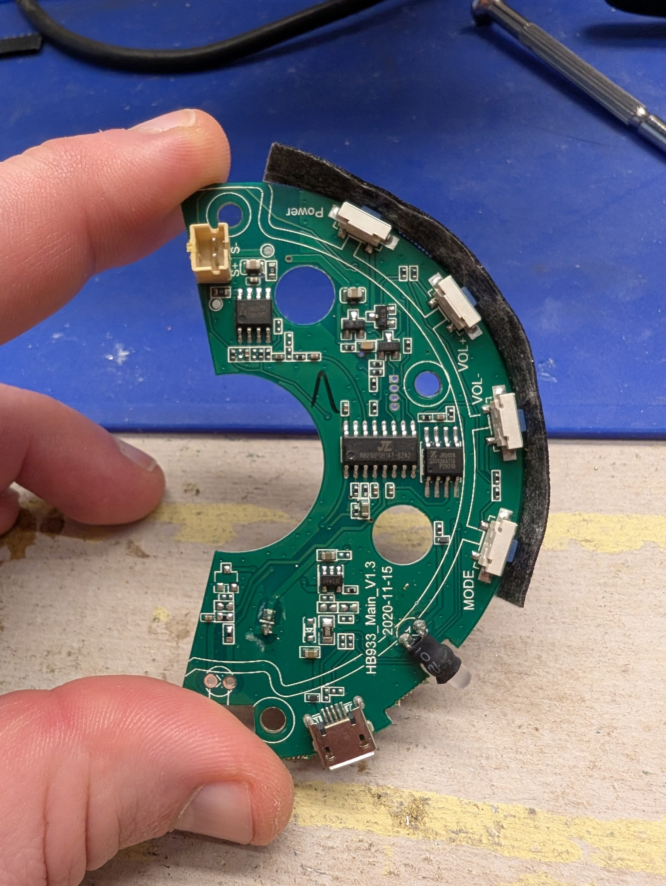
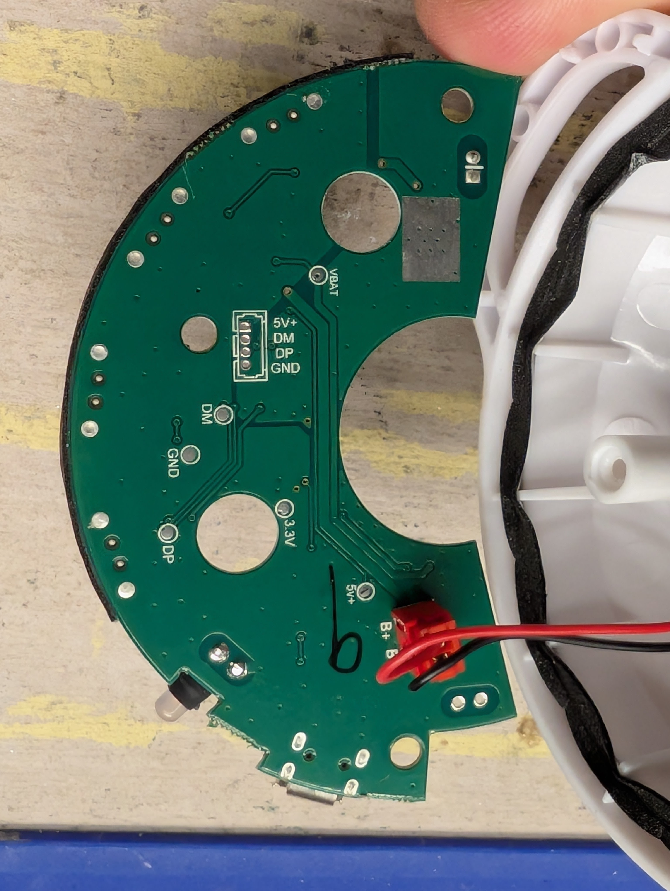
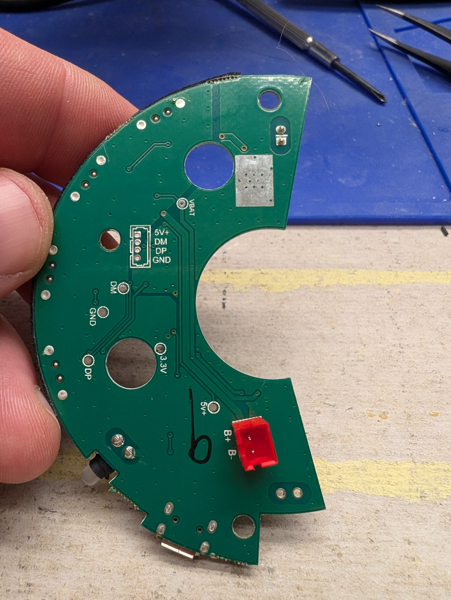
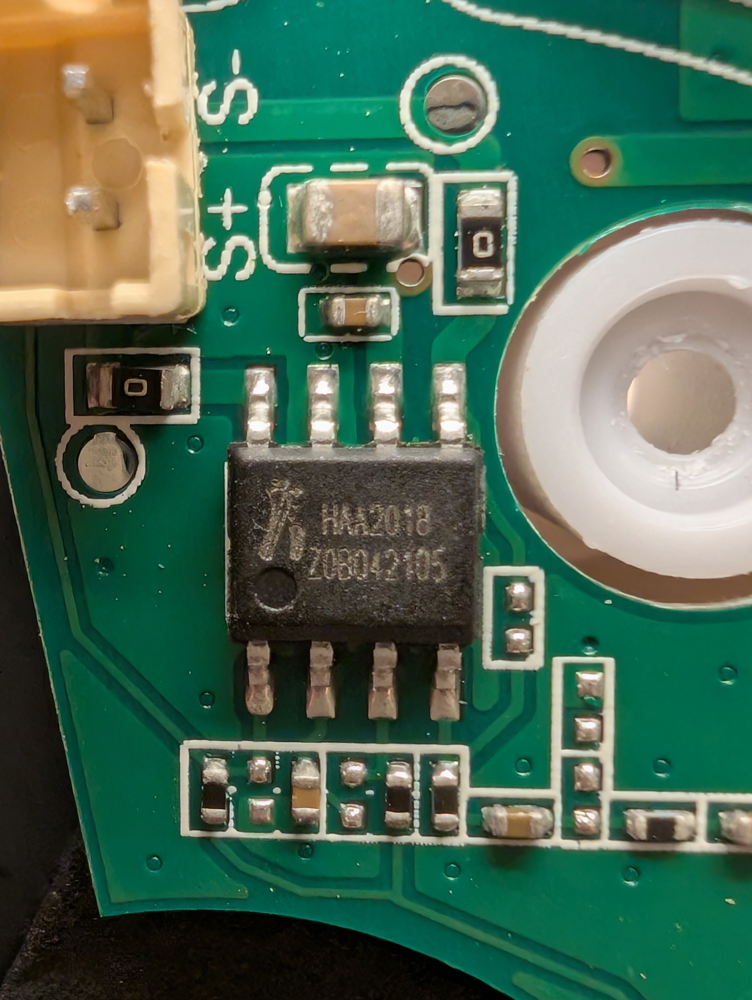
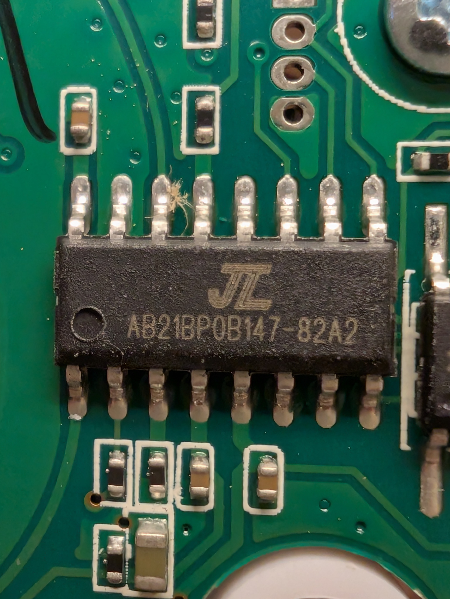
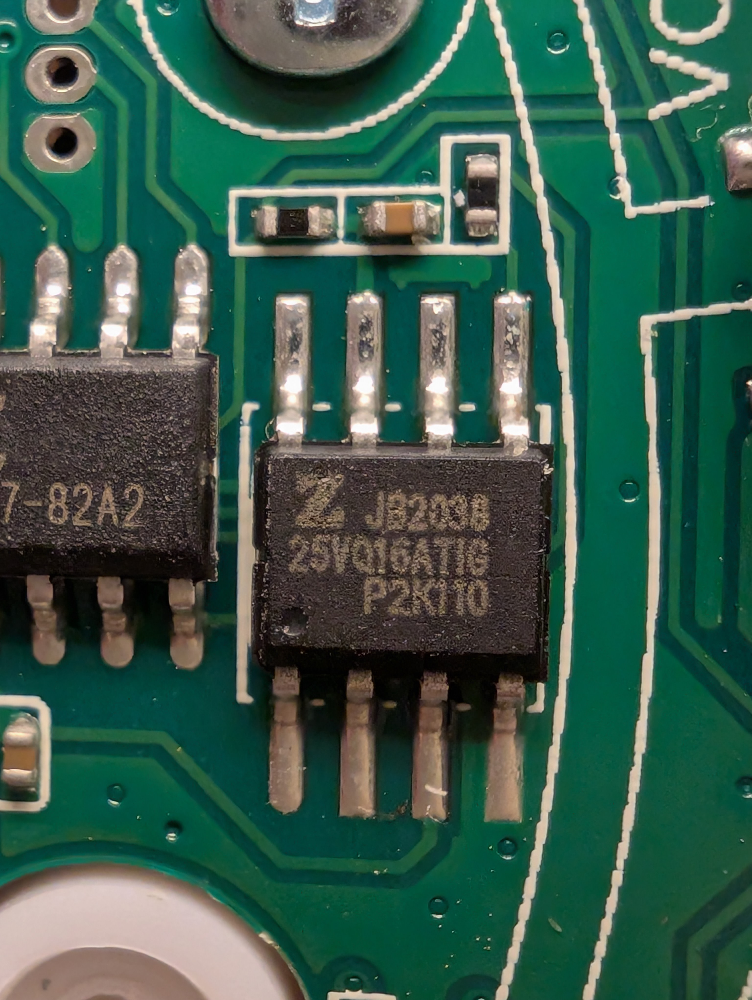
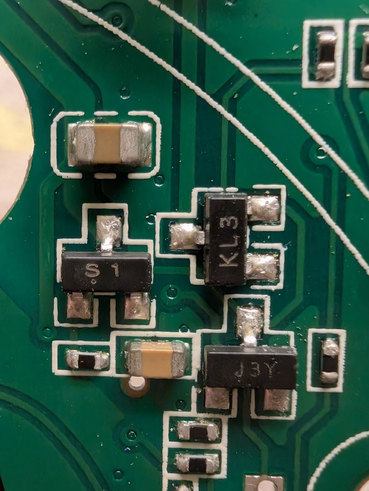

# YOGASLEEP ROHM 3RUS1WTBU





## Checklist

- [x] Reference materials
    - [x] Manufacturer docs
    - [n/a] Firmware updates
    - [n/a] OpenWRT support
    - [n/a] Pinouts
- [n/a] Factory reset
- [x] External documentation
- [x] Case opened
- [x] Internal documentation
- [x] Dumped ROM .reset
- [x] Extracted FW parts, inspected
- [n/a] Factory reset with boot
- [n/a] Dumped ROM regular
- [ ] Booted
- [ ] Root shell
- [ ] Pull stats
    - [ ] `uname -a`
    - [ ] `busybox --help`
    - [ ] `cat /proc/mtd`

## Critical Info


```text
Rating: 5V 500mA
Serial: 9RT212803924
```

## Reference material:

* [Manufacturer](https://yogasleep.com/products/rohm?srsltid=AfmBOorYJT_R4JtDMyWJuMWusmRxfItuO2EM5uujVBzKciAUvR_ulx5l)

## Inside

Case opens by removing the silicone foot,
and unscrewing four phillips screws.

### Boards

Just the one mainboard.
Speaker is on top,
battery is on bottom.

#### Mainboard







The mainboard has a microcontroller, flash ROM, four buttons, one LED,
an audio amplifier and speaker header,
battery controller and battery header,
and a USB micro-b female receptacle.

It is a two-layer, green circuit board, likely one of the FR phenolic family.
All components but the battery header are on the top surface of the board.

The lower surface has silkscreen for an unpopulated four-pin header.
There are also test points for:

* VBAT
* DM
* GND
* 3.3V DP
* 5V+

There is a two-pin header with neither pins nor silkscreen.

### Chips

#### ChipSourceTek Audio Power Amplifier HAA2018



#### JL Bluetooth Audio Microcontroller AB21BP0B147



Likely SOP-16 package.

Google says it probably does audio processing and battery management.
That looks about right.
"The specific marking AB21BP0B147-82A2 is a custom firmware identifier.
In the Rohm, it is likely a variant of the Jieli AC69 series."

It looks like further info is not available about this chip online.

1. ?
2. 22k ohms to unk header
3. GND
4. +5 at header
5. +3.3 at rom and TP
6. Rom pin 6
7. Rom pin 7
8. Rom pin 1
9. DM
10. DP
11. Eventually S-
12. LED+
13. Pulldown from +5 or vbat
14. HAA pin 4
15. ?
16. GND


#### Zbit Flash ROM



```text
ZB25VQ16ATIG

ZB => Zbit Semiconductor
25 => SPI Interface Flash
VQ => 2.5V extended, 4KB uniform sector, Quad Mode
16 => 16Mbit
A  => A Version
T  => SOP8 150mil
I  => Industrial(-40C to 85C)
G  => Pb free and halogen free

16 Mib = 2 MiB
```

Narrower package than what I usually see.

[Datasheet](https://semic-boutique.com/wp-content/uploads/2016/05/ZB25VQ16.pdf)

flashrom doesn't normally support this chip.
I'm adding it, but getting conflicting data.
Here's what I'm reading between flashrom and serprog:

| No. | Bytes from host (meaning)                                    | Bytes from serprog (meaning)                                                                                                     | Notes                                                                                    |
|-----|--------------------------------------------------------------|----------------------------------------------------------------------------------------------------------------------------------|------------------------------------------------------------------------------------------|
| 214 | 13 040000 020000 ab000000 (spi write ab000000, read 2 bytes) | 06 1414 (ACK, 1414)                                                                                                              |                                                                                          |
| 220 | 13 040000 020000 90000000 (spi write 90000000, read 2 bytes) | 06 0e14 (ACK, 0e14)                                                                                                              |                                                                                          |
| 148 | 13 010000 030000 9f (spi write 0x9f, read 3 bytes)           | 06 0e4015 (ACK, 0e4015)                                                                                                          |                                                                                          |

According to the docs, the interactions should be:

| Command Name                   | BYTE 1 (Instruction) | BYTE 2  | BYTE 3  | BYTE 4  | BYTE 5  | BYTE 6                      |
|--------------------------------|----------------------|---------|---------|---------|---------|-----------------------------|
| Release Power down / Device ID | -> 0xAB              | -> 0x__ | -> 0x__ | -> 0x__ | <- 0x14 | <- 0x14 (repeating forever) |
| Manufacturer/Device ID         | -> 0x90              | -> 0x__ | -> 0x__ | -> 0x00 | <- 0x5e | <- 0x14                     |
| JEDEC ID                       | -> 0x9F              | <- 0x5e | <- 0x60 | <- 0x15 |         |                             |

The IDs are not as shown in the documentation,
but I did get the chip added to flashrom,
and the ROM image extracted.

#### S1 NPN Bipolar Junction Transistor



S1 is an NPN BJT, possibly [MMBT5551](https://www.onsemi.com/download/data-sheet/pdf/mmbt5551-d.pdf).
SOT-23 package.

```text
 _3_
[___]
1   2
```

1. Base
2. Emitter, connects to pins 13 of the uC via resistors and a cap.
3. Collector, connects to pins 6/7 (via cap) of the HAA amp.

#### KL3 BAT54C Schottky Barrier Diode


KL3 is a [BAT54C Schottky barrier diode, common cathode](https://assets.nexperia.com/documents/data-sheet/BAT54C.pdf).
SOT-23 package.

```text
 _3_
[___]
1   2
```

1. Anode 1
2. Anode 2
3. Cathodes 1 and 2

#### JY3 S8050 NPN Transistor

JY3 is a [S8050 NPN transistor](https://datasheet.lcsc.com/lcsc/2310131500_Jiangsu-Changjing-Electronics-Technology-Co---Ltd--S8050-J3Y-RANGE-200-350_C2146.pdf).
SOT-23 package.

```text
 _3_
[___]
1   2
```

1. Base
2. Emitter
3. Collector

### Firmware

See [firmware analysis](firmware-analysis/README.md).

### Conclusion: ?
