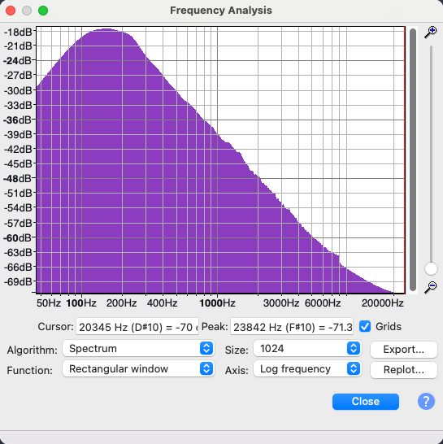

# Firmware Analysis

I was able to access firmware from the Zbit 2 MiB flash ROM chip.
I was not able to access firmware from the JL microcontroller.

The firmware is a FAT12-sized VFAT filesystem containing three MP3 files:

| Bytes  | Name |
|--------|------|
| 150912 | 1.Deep White Noise_201128.mp3 |
| 968599 | 2.Ocean_201128.mp3 |
| 114583 | 3.bright_201128.mp3 |

The bootloader code embedded in the FAT header is copyright Microsoft.
The manufacturer probably didn't have rights to distribute it--
not that anyone's going to make a fuss about it.
The fact that it's x86 code implies that it probably isn't meaningful here.

The FAT filesystem claims the whole space of the ROM,
but the last sector is zeroed without explanation.

## File Formats

The `file` command identifies the files as follows:

```text
1.Deep White Noise_201128.mp3: MPEG ADTS, layer III, v1, 128 kbps, 48 kHz, Monaural
2.Ocean_201128.mp3:            Audio file with ID3 version 2.3.0, contains: MPEG ADTS, layer III, v1, 128 kbps, 48 kHz, Monaural
3.bright_201128.mp3:           Audio file with ID3 version 2.3.0, contains: MPEG ADTS, layer III, v1, 128 kbps, 48 kHz, Monaural
```

`exiftool` shows the following:

All three files are:

| Property | Value |
|-|-|
| AudioBitrate | 128 kbps |
| AudioLayer | 3 |
| CopyrightFlag | FALSE |
| FileType | MP3 |
| MIMEType | audio/mpeg |
| MPEGAudioVersion | 1 |
| MSStereo | Off |
| SampleRate | 48000 |

Track `1.Deep White Noise_201128.mp3` has many blank fields.
Tracks `2.Ocean_201128.mp3` and `3.bright_201128.mp3` are:

| Format | audio/mpeg |
|-|-|
| Genre | Blues |
| HistorySoftwareAgent | Adobe Audition CS6 (Windows) |
| HistoryWhen (approx) | 2020:11:14 15:33:14+08:00 |
| MetadataDate (approx) | 2020:11:14 15:33:14+08:00 |
| ModifyDate (approx) | 2020:11:14 15:33:14+08:00 |
| TracksFrameRate | f48000, f48000 |
| TracksTrackName | CuePoint Markers, Subclip Markers |
| TracksTrackType | Cue, InOut |
| XMPToolkit | Adobe XMP Core 5.3-c011 66.145661, 2012/02/06-14:56:27 |

## Audio

### 1.Deep White Noise_201128.mp3

This file contains noise.
Despite the name, it is not white noise.
It probably was, but now shows a frequency-domain peak centered on 153 Hz.



[Spectrum data](spectrum.1.txt)

I generated a similar-sounding tone in Audacity by:
1. Generating 9.43 seconds of white noise, amplitude 1.
2. Applying a [filter curve EQ that looks like the spectrum analysis above](filter_curve.txt).
3. Adjusting amplitude to match the original: -4.1 dB (%50 peak-to-peak).
4. Export to MP3.

The resulting file was 151880 bytes. The original was 150912 bytes, so pretty close.

[1.Deep White Noise_201128-free.mp3](../firmware-images-free/files/1.Deep White Noise_201128-free.mp3)

### 2.Ocean_201128.mp3

Appears to be a white noise base,
with a bandpass filter that changes over time,
mimicking the sound of breaking surf.

### 3.bright_201128.mp3

Similar to `1.Deep White Noise_201128.mp3` but with a different filter profile.

## Signatures

Hashes from the original, non-free ROM are in `sha256sums`.
